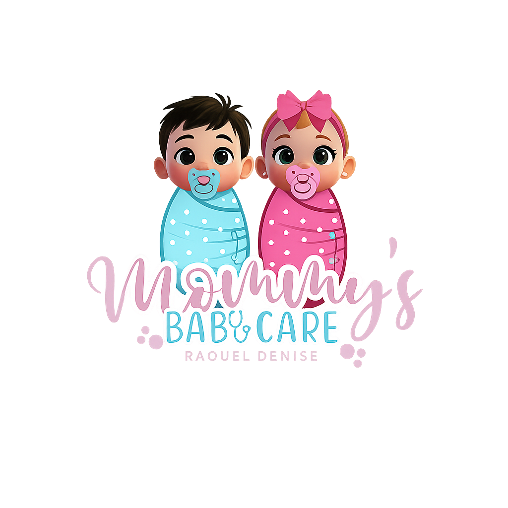

  

  # Mommys Baby Care 👶
  
  **Aplicativo Mobile para Gestão Profissional no Ramo Materno-Infantil**
  
  
  
  
  

 

## 📌 Sobre o Projeto

O **Mommys Baby Care** é uma solução móvel completa desenvolvida para profissionais que atuam com consultoria materno-infantil, furos de orelha humanizados e amamentação. 

Este projeto foi construído para resolver o problema de gestão descentralizada (papéis, planilhas e agendas de papel), consolidando tudo em um único ecossistema mobile. A arquitetura foi pensada para ser escalável, offline-first em pontos críticos e com uma interface altamente responsiva.

---

## 🚀 Destaques Técnicos & Arquitetura

Ao desenvolver este aplicativo, foquei não apenas nas funcionalidades, mas na qualidade do código e na experiência do usuário (UX):

- **Navegação Moderna:** Utilização do **Expo Router** (File-based routing), garantindo rotas tipadas, deep linking simplificado e uma estrutura de pastas intuitiva.
- **Tipagem Estrita (TypeScript):** Todo o fluxo de dados, desde a persistência no banco até os componentes visuais, é fortemente tipado. Isso previne bugs em tempo de compilação e torna o código mais previsível.
- **Integração Cloud (Firebase):** 
  - *Firestore* para banco de dados NoSQL estruturado (Clientes, Fichas, Despesas).
  - *Storage* para armazenamento de evidências visuais (fotos de antes e depois dos procedimentos).
- **UX e Componentização:** 
  - Criação de máscaras customizadas para inputs (CPF, Telefone).
  - Assinatura digital implementada nativamente (`react-native-signature-canvas`).
  - Utilização do `KeyboardAvoidingView` para garantir que formulários complexos sejam fluidos e não sejam sobrepostos pelo teclado em telas menores.
- **Design System Modular:** Cores, espaçamentos e tipografias abstraídos em arquivos de `constants`, facilitando suporte a múltiplos temas no futuro.

---

## 📱 Funcionalidades (Visão do Produto)

- 👥 **Gestão de Pacientes/Clientes:** CRM integrado para buscar e manter o histórico completo de clientes.
- 📋 **Prontuários e Fichas Inteligentes:** Geração de fichas de atendimento especializadas (Furo de Orelhinha, Consultoria em Amamentação).
- ✍️ **Assinatura Digital Nativizada:** O cliente assina os termos de responsabilidade na própria tela do dispositivo.
- 📸 **Upload de Mídia:** Captura de fotos (Antes/Depois) via `expo-image-picker` com compressão e envio para a nuvem.
- 🗓 **Agenda:** Controle de horários e compromissos diários.
- 💰 **Dashboard Financeiro:** Módulo para controle de fluxo de caixa (entradas e despesas dos atendimentos).

> **Nota para o recrutador:** Este repositório é uma amostra do meu código e das minhas habilidades arquiteturais em Mobile. O aplicativo lida com dados sensíveis de pacientes na vida real, portanto, as credenciais e o banco de dados de produção foram removidos por motivos de segurança e privacidade (LGPD).

---

## 💻 Como Explorar o Código

Se você deseja avaliar a estrutura do código:
1. Veja a pasta `/app` para entender o fluxo de telas (Expo Router).
2. Verifique `/components` para componentes isolados e reutilizáveis.
3. Acesse `/firebase` para ver como a abstração do banco de dados foi construída.

Para rodar localmente, será necessário injetar variáveis de ambiente próprias do Firebase no arquivo de configuração, simulando um ambiente de staging.

---

  <b>Desenvolvido por Felipe</b> | Apaixonado por criar soluções que impactam o mundo real através de código limpo.

